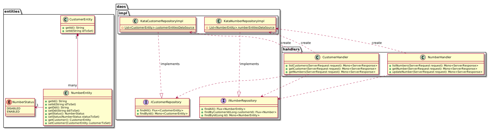

# ANDigital - Coding challenge

Table of Contents
=================
  * [About the project](#about-the-project)
  * [Tech stack](#tech-stack)
  * [Run the application](#run-the-application)
  * [API documentation](#api-documentation)
     * [Numbers API](#numbers-api)
        * [Find all numbers (scenario: get all phone numbers)](#find-all-numbers-scenario-get-all-phone-numbers)
        * [Find number via id](#find-number-via-id)
        * [Update a number (scenario: activate a phone number)](#update-a-number-scenario-activate-a-phone-number)
     * [Customers API](#customers-api)
        * [Find all customers](#find-all-customers)
        * [Find customer via ID](#find-customer-via-id)
        * [Find all numbers for a given customer (scenario: get all phone numbers of a single customer)](#find-all-numbers-for-a-given-customer-scenario-get-all-phone-numbers-of-a-single-customer)
  * [Test the application](#test-the-application)
     * [Number API](#number-api)
     * [Customer API](#customer-api)
  * [Test data](#test-data)
  * [Class diagram](#class-diagram)

## About the project
In the exercise we pretend that we are working for a telecom provider.  
The provider needs a new API with initially just three endpoints.  
We would like you to spec out those endpoints and provide sample implementations for those API
endpoints.  
In our (imaginary) database, we are starting to store phone numbers associated to customers (1
customer : N phone numbers) and we will provide an API to modify them.  
We need 3 APIs:  
- get all phone numbers
- get all phone numbers of a single customer
- activate a phone number  

## Tech stack
TDD project based on a functional and reactive implementation.  
- **Web framework**: Spring webflux  
- **Reactive library**: Project reactor  
- **Test dependencies**: Spring boot starter test - JUnit jupiter  
- **Build tool**: Gradle  


## Run the application
```commandline
git clone https://github.com/SofianeSadiPro/andigital-test.git
cd andigital-test
./gradlew clean build
java -jar ./build/libs/sofianesadi-0.0.1-SNAPSHOT.jar
```

## API documentation
As springfox swagger is currently not available for spring webflux, we are describing the API via the readme.
### Numbers API
#### Find all numbers (scenario: get all phone numbers)
- **URL**: /api/numbers
- **Method**: GET
- **Success Response**:   
    - **Code**: 200  
    - **Content**:   
    ```json
    [
        {
            "id": 1,
            "ddi": "07492525820",
            "customerEntity": {
                "id": 1
            },
            "status": "ACTIVATED"
        },
        {
            "id": 2,
            "ddi": "07492525821",
            "customerEntity": {
                "id": 2
            },
            "status": "DEACTIVATED"
        }
    ]
    ```
- **Error Response**:  
    **Code**: 404 Not found - If no numbers found.  

#### Find number via id
- **URL**: /api/numbers/{id}
- **Method**: GET
- **Success Response**:   
    - **Code**: 200  
    - **Content**:   
    ```json
        {
            "id": "1",
            "ddi": "07492525820",
            "customerEntity": {
                "id": "1"
            },
            "status": "ACTIVATED"
        }
    ```
- **Error Response**:  
    **Code**: 404 Not found - If no numbers found.  
    
#### Update a number (scenario: activate a phone number)
- **URL**: /api/numbers/{id}
- **Method**: PUT
- **URL Params**: 
    * *id*: Number ID
- **Body**: 
    ```json
    {
       "id": "1",
       "ddi": "07492525820",
       "customerEntity": {
           "id": "1"
       },
       "status": "ACTIVATED"
   }
    ```
- **Success Response**:   
    - **Code**: 200  
    - **Content**:   
    ```json
   {
       "id": "1",
       "ddi": "07492525820",
       "customerEntity": {
           "id": "1"
       },
       "status": "ACTIVATED"
   }
    ```
- **Error Response**:  
    **Code**: 404 Not found - If number not found for the given id.
    
### Customers API
#### Find all customers
- **URL**: /api/customers
- **Method**: GET
- **Success Response**:   
    **Code**: 200  
    **Content**:   
    ```json
    [
        {
            "id": "1"
        },
        {
            "id": "2"
        },
        {
            "id": "3"
        },
        {
            "id": "4"
        }
    ]
    ```
#### Find customer via ID
- **URL**: /api/customers/1
- **Method**: GET
- **Success Response**:   
    **Code**: 200  
    **Content**:   
    ```json
        {
            "id": "1"
        }
    ```
    
#### Find all numbers for a given customer (scenario: get all phone numbers of a single customer)
- **URL**: /api/customers/{id}/numbers
- **Method**: GET
- **URL Params**: 
    * *id*: Customer ID
- **Success Response**:   
    **Code**: 200  
    **Content**:   
    ```json
    [
        {
            "id": "1",
            "ddi": "07492525820",
            "customerEntity": {
                "id": "1"
            },
            "status": "ACTIVATED"
        },
          {
            "id": "3",
            "ddi": "07492525823",
            "customerEntity": {
                "id": "1"
            },
            "status": "ACTIVATED"
        }
    ]
    ```

## Test the application
Using postman: An export of the collection is available in "documentation/test_andigital_sofianesadi.postman_collection.json".   

Using curl:
### Number API
- Get all phone numbers:
```commandline
curl -X GET http://localhost:8080/numbers 
```

- Get a phone numbers via id:
```commandline
curl -X GET http://localhost:8080/numbers/1
```

- Update a phone numbers (set status to activated):
```commandline
curl -X PUT \
  http://localhost:8080/numbers/2 \
  -H 'Content-Type: application/json' \
  -d '{
    "id": 2,
    "ddi": "07492525822",
    "customerEntity": {
        "id": 1
    },
    "status": "ACTIVATED"
}'
```

### Customer API

- Get all customers:
```commandline
curl -X GET http://localhost:8080/customers 
```

- Get customer via id:
```commandline
curl -X GET http://localhost:8080/customers/1
```

- Get all phone numbers for a given customer:
```commandline
curl -X GET http://localhost:8080/customers/1/numbers 
```

## Test data
This is the test numbers used by the kata DAO:

|Id | DDI | Customer ID | Status
|---|--------------|---|------------|
| 1 | "07492525820"| 1 | DEACTIVATED|
| 2 | "07492525821"| 2 | DEACTIVATED|
| 3 | "07492525822"| 3 | DEACTIVATED|
| 4 | "07492525823"| 1 | DEACTIVATED|
| 5 | "07492525824"| 2 | DEACTIVATED|
| 6 | "07492525825"| 3 | DEACTIVATED|
| 7 | "07492525826"| 1 | DEACTIVATED|
| 8 | "07492525827"| 2 | DEACTIVATED|
| 9 | "07492525828"| 4 | DEACTIVATED|

After an application restart the test data are reset.

## Class diagram
Note: Following the specifications, we are not going to use any database, the DAO will be using a static list. 

  
